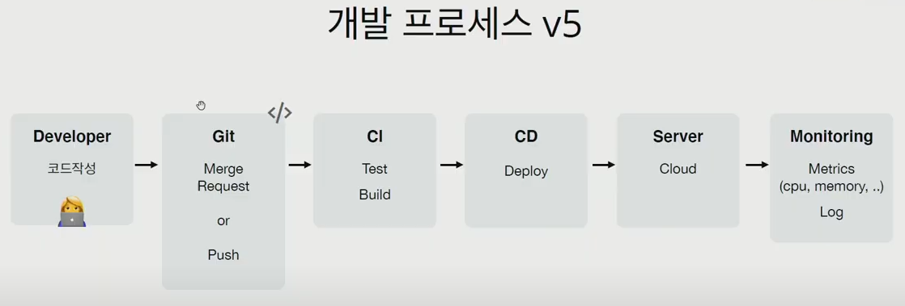

# 2021-07-07

# [도커와 쿠버네티스]

## 취업

## CS학습

- 정보처리기사 - 전체 완료 - 계속 필기 복습 또 복습!!

## 특강 

도커와 쿠버네티스

CI/CD : test, 빌드  / 배포

### 서버 관리

자체 > 설정 관리 > 가상 머신 > 클라우드 > PaaS > 도커 > 쿠버네티스 > 서비스메시

1. 자체 - 과정이 복잡하다. 단계마다 명령어가 다르다. 버전 업로드가 어렵다.

2. 설정 관리

3. 가상 머신 - 느리다. 공유는?

4. 클라우드 - 서버 운영의 문제는 여전히 남아있다.(누군가는 관리해야한다.)

5. PaaS - 서버 운영의 복잡함 해결(소스코드만 있으면 가능) > 서버 운영의 은총알(너무 편하다) / PaaS 틀에 맞춰야 한다. 세부적 관리는 어렵다

6. 도커와 쿠버네티스 - 방식이 완전히 바뀌었다.

   도커 : 어떠한 프로그램도 컨테이너로 만들 수 있다. > 어디서든 돌아간다. > 관리가 힘들다, 배포는??

   쿠버네티스 : 컨테이너를 쉽고 빠르게 배포/확장하고 관리를 자동화해주는 오픈소스 플랫폼 : 컨테이너 관리 도구

### 도커 쿠버

### 배포/쿠버네티스

## JIRA & JQL

이슈 타입

- 스토리 : 사용자가 하는 일
- TASK : 기능 개발
- BUG : 오류 발생
- EPIC : 여러 이슈를 집합으로 만들 것

JQL : Jira query language

- SQL과 비슷한 문법
- ADVANCED에서 BASIC 있음
- 여러가지 FUNCTION 검색 후 확인
- Filter - 사용자 지정 필터 만들어 공유 가능
- dashboard - 

----------------------------------------------------------------------------------------------------------------------------------------------------------------------------------------------------------------------------

| 기업           | 일정             | 상태      | 비고                                                         |
| -------------- | ---------------- | --------- | ------------------------------------------------------------ |
| 딜리버리히어로 | 6/25일 코테 결과 | 코테 탈락 | 홀수 합성수 문제 풀이 해결(규칙 찾기, dp, 백트래킹)          |
| KINX           | -                | 서류 탈락 | 급하게 준비했나?... ㅠㅠ 힘내봅시다                          |
| 파수           | -                | 서류 탈락 | 허허.....;;                                                  |
| 엔카           | -                | 서류 제출 |                                                              |
| 엔테크서비스   | -                | 코테 탈락 | 유니온파인드, SQL에 대한 학습 필요하다. 수학적 문제, sql알아두자! |
| 하이닉스       | -                | 서류 탈락 |                                                              |

