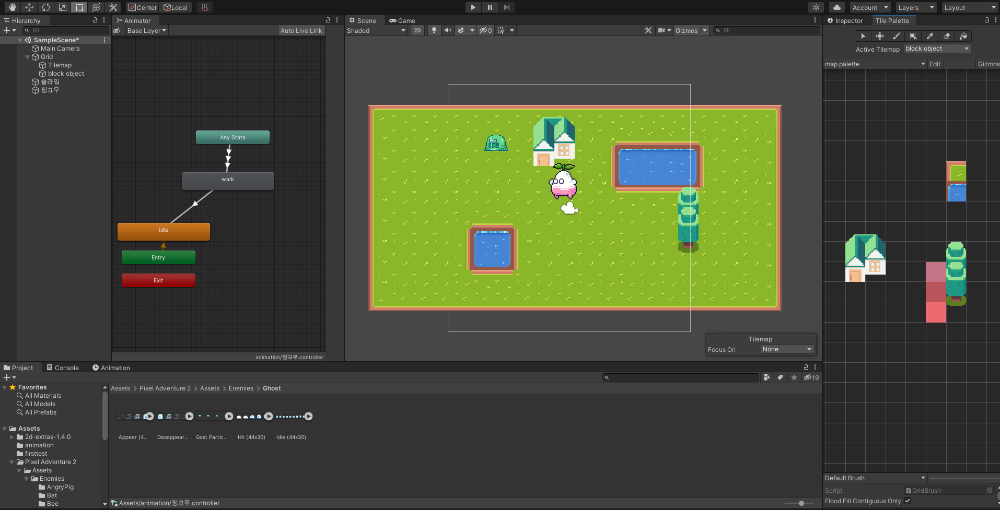
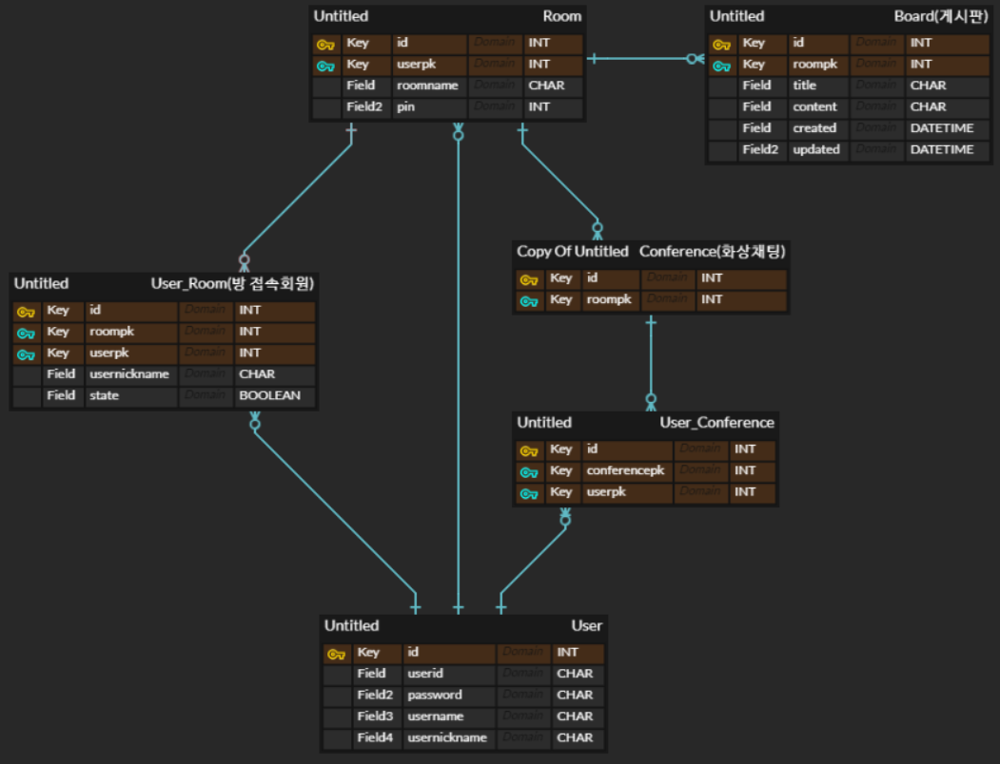
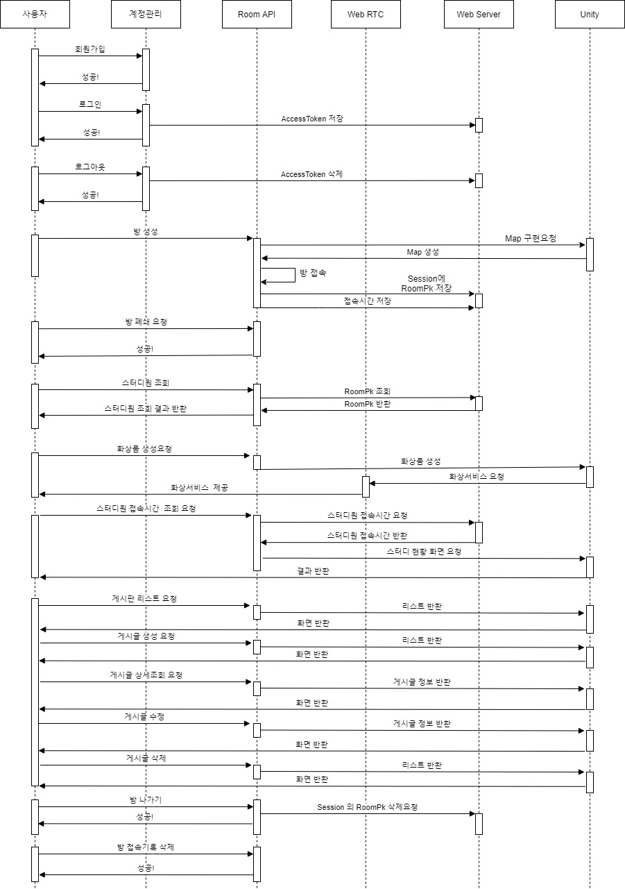

# 2021-07-20

# [화면정의서_유니티]

### 화면정의서

-  [화면정의서.pdf](2021-07-20[화면정의서_유니티].assets\화면정의서.pdf) 

### 유니티 관련 배운 사항 (Unity)

- 2D 게임 형식의 캐릭터 이동 및 이벤트 발생을 위해 유니티 프로그램 활용
- 해결한 기능
  1. 맵 구현/캐릭터 구현 및 표현
  2. 캐릭터 이동 및 장애물 block
- 해결해야할 기능
  1. 접촉 시 이벤트 발생! 이게 제일 중요

### ERD 및 시퀀스 다이어그램

- ERD

  크게 USER - ROOM - CONFERENCE 세가지만 구축되어 있으면 된다.

  USER-ROOM, USER-CONFERENCE 잇는 관계 테이블을 만들어 N:M관계를 만들어 준다.

  ROOM-CONFERENCE가 만들어 질 수 있도록 1:N 관계를 만들어 준다.

- 시퀀스 다이어그램

  기능별 요청/반환 순서를 나타냈다.

  UNITY와 VUE에 대한 프론트 과정은 그 방법을 더 알아봐야 하기 때문에 UNITY를 FRONT라 생각하고 구조화했다.

  

