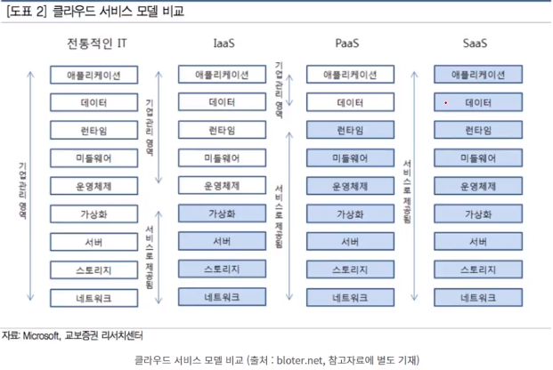

# 2021-07-21

# [클라우드_유니티]

### 클라우드

- 사람 - 인터넷 - cdc(cloud data cencter)/idc(internet data center)

- 수백만대의 컴퓨터가 연결된,

- 가상화 : 물리적 특성을 숨기고 사용자에게 추상화된 가상 자원을 제공하는 기술

  -  물리머신
  -  하이퍼 바이저 위에 게스트 os : 오버헤드
  -  하이퍼 1개위에 다양한 게스트 os
  -  컨테이너 가상황 : no 하이퍼바이저, no 게스트 os - Linux
  -  윈도우 - 3번 하이퍼 1개 위에 여러 os 설치

-  클라우드 스토리지 서비스 - dropgbox, googlecloud

-  클라우드 스트리밍 서비스

   ---------------------------------------

-  onpromise 방식(개인 서버) - public 방식 - 하이브리드 방식 - 2개의 클라우드에 안전하게(멀티)

