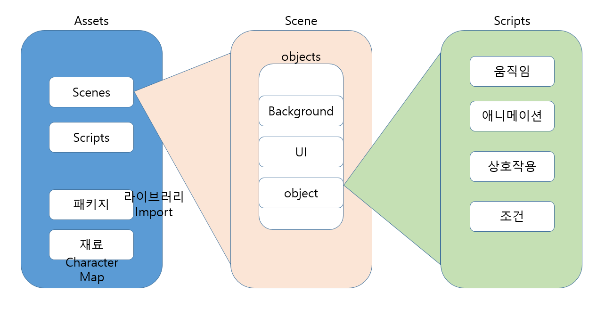
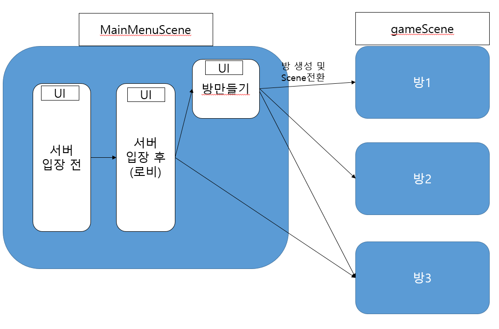
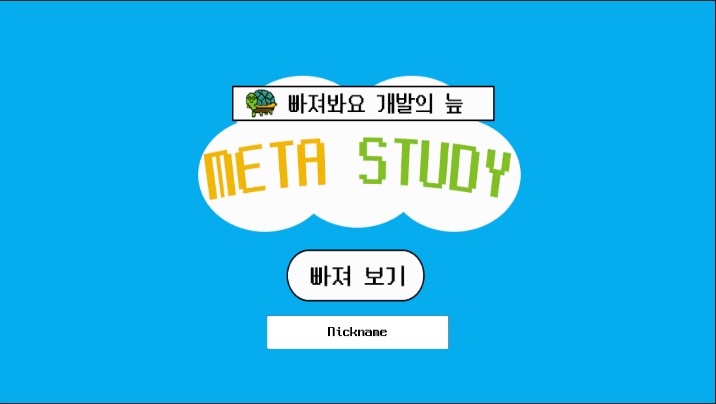
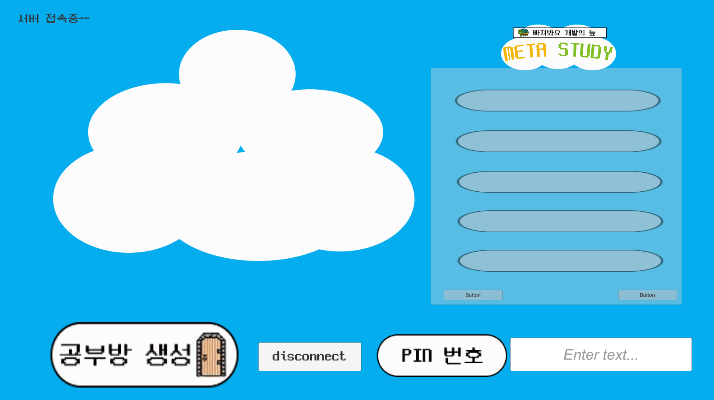
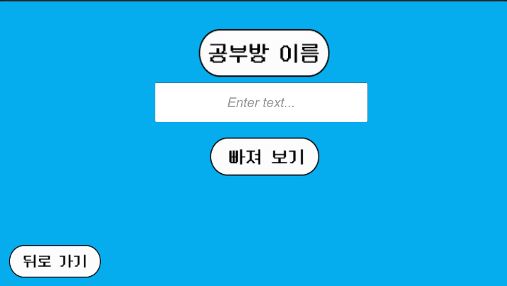
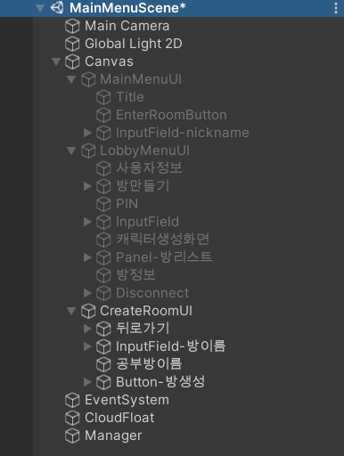
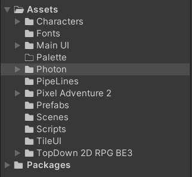

# 2021-07-27

# [유니티학습] - 네트워크/서버접속/멀티방 구현

> 유니티를 통해 게임 화면의 네트워크를 구현하고 싶은 사람들을 위한 정리

## 유니티?

3D 및 2D 비디오 게임의 개발 환경을 제공하는 게임 엔진이자, 3D 애니메이션과 건축 시각화, 가상현실(VR) 등 인터랙티브 콘텐츠 제작을 위한 통합 제작 도구

즉, 물리엔진, 상호작용 등의 게임 개발을 위한 도구다. (ps4, 닌텐도 등의 게임을 만드는데 사용)

게임 엔진 종류(TOP2)  - 높은 성능, 상용화

1. 유니티(unity)
2. 언리얼(unreal)

왜 유니티를 선택했는가? 
▶무료로 모든 기능 사용, 2D 제작에 용이(언리얼은 3D 우수), 시스템 사양 가벼움


#### 기본 구조



## 네트워크 - 서버접속 - 방생성/참가

https://www.youtube.com/playlist?list=PLYQHfkihy4Aw6QjsZqwwbD4ihpwvm7N0U - 유튜버 베르의 게임 개발

https://www.youtube.com/watch?v=JY-KFx3OsJo&list=PLO-mt5Iu5TeYfyXsi6kzHK8kfjPvadC5u - 골드메탈 블로그

https://doc.photonengine.com/en-us/pun/current/demos-and-tutorials/pun-basics-tutorial/intro - Photon Document

https://tech.lonpeach.com/2019/09/30/UniRx-Photon-Cloud-RoomList/ - 블로그

https://m.blog.naver.com/PostView.naver?isHttpsRedirect=true&blogId=jbaeg&logNo=221160288582 - 하얀바람 블로그

https://www.youtube.com/watch?v=mPCNTi3Booo - 고라니TV ★★★

위 블로그 및 유튜브 자료들은 단지 위 네트워크/서버 및 방 생성의 기능을 구현하기 위해 접하게 된 교육 자료들이다. 
모든 자료들이 유익하지만, 프로그램의 버전이 바뀌고 업데이트 등의 이유로 지금 버전에 지원되지 않는 기능/함수/메서드 들이 있기에 아래 정리를 참고해보자.

유니티에서 네트워크/멀티플레이 구현을 위한 플랫폼으로 photon을 지원한다. (Mirror도 있다)

#### Photon

> 멀티 플레이어 플랫폼

- 장점 : 자체 게임 데이터 저장 및 개발을 위한 photon 서버(무료 20명)를 제공하여 쉽게 연결하여 사용할 수 있다.


기본적으로 유니티를 통한 멀티네트워크 작동 순서는

1. 실행
2. 서버접속(photon)
3. 방 생성/참가
4. 멀티플레이

이 순서가 되지 않으면, 중간 중간 에러가 발생한다. 게임 실행시, 서버접속을 해야하고, 그 후에 방을 만들거나 만들어진 방에 참여할 수 있다.


### 그러면 어떤 순서대로 개발을 진행해야 하는가

> Unity 간단한 프로젝트 하나라도 만들어 봤으면 아래 구조에 대해 이해를 할 수 있을 것이다. UI가 뭔지, Scene이 뭔지 등



- Scene : 실제 게임에서 보여지는 화면과 그 안에 있는 오브젝트(사람, 건물, 텍스트 등등)를 모두 포괄하는 개념이다. 프론트에 있어 가장 큰 개념
- UI : 한 Scene내에서 전환마다 보여지는 요소들이다.


### 1. 화면 구성하기

> 필요한 Scene, UI, 오브젝트 등을 보이는 그대로를 나열해두자. 프론트의 기본! 구성요소 나열하고 기능/동작은 나중에!

###### 

3가지 UI를 만들었다. 그냥 오브젝트,버튼 등을 아래 Hierarchy 구조로 우선 나타낸다.

★추가로 manager라는 오브젝트를 만든다. UI간, UI내에서의 작동을 조작한다. MainMenuScene을 컨트롤하기 위한 센터라고 생각하자.

###### 


### 2. 기능/동작을 넣어주기 - 여기가 c#을 이용한 코딩을 하는 부분이다.

> 각 오브젝트에 scripts를 통해 동작, 기능을 할 수 있도록 개발해준다.

unity 및 photon에서 이미 구현되어 있는 메서드를 활용하여 쉽게 원하는 기능을 구현할 수 있다.

#### method - 참 쉽게 개발할 수 있도록 만들어져 있다. 이해하는데는 오래걸림..

1. PhotonNetwork.ConnectUsingSettings()
2. PhotonNetwork.CreateRoom()
3. PhotonNetwork.JoinRoom()
4. 등등


### Assets 구조

###### 

저자는 필요한 그림(오브젝트 구성요소들) 등을 import하여 많지만, 실제 필요한 것만 정리하면

- Photon : assets store에서 photon pun2 free를 다운받으면 import할 수 있다. 네트워킹 구현을 위한 패키지 파일이 들어있다.

- Scenes : 처음 Scenes 폴더에 이름이 지정되지 않은 SampleScene이 있다. Scene이름을 지정하고 Scene 필요시 지정해야한다.

  저자는 samplescene을 MainMenuScene으로 바꾸고 추가로 게임진행 scene을 위한 gameScene을 만들었다.

- **Scripts : 가장 중요한 것으로, 모든 기능들을 넣어두는 scripts 폴더이다. manager오브젝트에 넣어줄 launcher scirpts를 만들었다.**


#### 가장 중요한 launcher scripts - manager 오브젝트 컴포넌트로 넣어준다.

```c#
// 포톤을 사용하기 위한
using Photon.Pun;
using Photon.Realtime;
using System.Collections.Generic;
using UnityEngine;
// inputField 클라스 이용을 위한
using UnityEngine.UI;
// scene 전환을 위한
using UnityEngine.SceneManagement;

public class Launcher : MonoBehaviourPunCallbacks
{
    string gameVersion = "1";

    // nickname, 환영 text와 연동을 위한
    public InputField nickName;
    public Text WelcomeText;

    // 만들 방의 정보(우선 이름만 넣어두자.)
    public InputField roomName;
    

	// 서버 연결을 위해 씬 시작시 AWAKE가 실행된다.
    #region 서버연결
    void Awake()
    {
        // 네트워크 동기화를 위해
        PhotonNetwork.AutomaticallySyncScene = true;

    }
    
    // 기본 구조는 행동 함수, 그리고 ON행동 함수 실행, 그리고 행동 실패시 함수 를 차례로 나열했다.
    // 접속
    public void Connect() => PhotonNetwork.ConnectUsingSettings();
    public override void OnConnectedToMaster() => PhotonNetwork.JoinLobby();
    public override void OnJoinedLobby()
    {
        PhotonNetwork.LocalPlayer.NickName = nickName.text;
    }
    public void Disconnect() => PhotonNetwork.Disconnect();
    public override void OnDisconnected(DisconnectCause cause) => print("연결끊김");

    // 방생성 - CreateRoom시 onJoinRoom이 실행된다.
    public void BtnCreateRoom() => PhotonNetwork.CreateRoom(roomName.text == "" ? "Room" + Random.Range(1,100) : roomName.text, new RoomOptions { MaxPlayers = 5 });
    public void onCreateRoomFailed(short returnCode, string message) => print("방만들기 실패");
    public override void OnCreatedRoom() => print("방만들기 완료");
    
	// 방참가
    public void JoinRoom() => PhotonNetwork.JoinRoom(roomName.text);
    public override void OnJoinedRoom()
    {
        SceneManager.LoadScene("Room for 1");
        print("방참가완료");
    }
    public override void OnJoinRoomFailed(short returnCode, string message) => print("방참가실패");
    #endregion

        	
        
    // 이부분을 넣어두면 디버그 및 개발 구현이 제대로 됬는지 확인가능하다. script 우클릭 후 '정보' 클릭!
    [ContextMenu("정보")]
    void Info()
    {
        if (PhotonNetwork.InRoom)
        {
            print("현재방 이름 : " + PhotonNetwork.CurrentRoom.Name);
            print("현재방 인원수 : " + PhotonNetwork.CurrentRoom.PlayerCount);
            print("현재방 최대인원수 : " + PhotonNetwork.CurrentRoom.MaxPlayers);

            string playerstr = "방에 있는 플레이어 목록 : ";
            for (int i = 0; i < PhotonNetwork.PlayerList.Length; i++) playerstr += PhotonNetwork.PlayerList[i].NickName + ',';
            print(playerstr);
        }
        else
        {
            print("접속한 인원수 : " + PhotonNetwork.CountOfPlayers);
            print("방 개수 : " + PhotonNetwork.CountOfRooms);
            print("모든 방에 있는 인원 수 : " + PhotonNetwork.CountOfPlayersInRooms);
            print("로비에 있는가? : " + PhotonNetwork.InLobby);
            print("연결됐는가? : " + PhotonNetwork.IsConnected);
            
        }
    }
}

```

