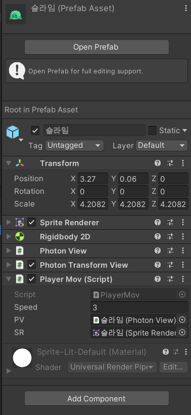
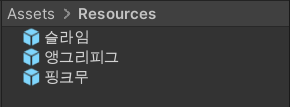
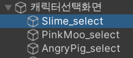

# 2021-07-28_29

# [캐릭터선택/멀티룸입장]

###### 


### 1. 캐릭터 선택 기능 구현



- DataMgr 스크립트를 담은 오브젝트와 select 스크립을 담은 선택 버튼들을 만들어준다

  DataMgr 스크립트 내에 선택된 정보가 담겨있도록 하는 것이다.

  또한 DontDestroyOnLoad로 datamanager 오브젝트가 사라지지 않도록 한다.

- DataMgr scripts

  ```c#
  using System.Collections;
  using System.Collections.Generic;
  using UnityEngine;
  
  public enum Character
  {
      Slime, PinkMoo, AngryPig
  }
  public class DataMgr : MonoBehaviour
  {
      public static DataMgr instance;
      private void Awake()
      {
          if (instance == null) instance = this;
          else if (instance != null) return;
          DontDestroyOnLoad(gameObject);
      }
  
      public Character currentCharacter;
  }
  ```

- Selectcharacter scripts

  ```c#
  using System.Collections;
  using System.Collections.Generic;
  using UnityEngine;
  
  public class SelectCharacter : MonoBehaviour
  {
      public Character character;
      public void OnChangeCharacter()
      {
          //ui 내에 보여지고 안보여지고를 나타내기 위해 find 함수로 setactive 여부를 결정함
          GameObject.Find("BigChar").transform.Find(DataMgr.instance.currentCharacter.ToString()).gameObject.SetActive(false);
          DataMgr.instance.currentCharacter = character;
          GameObject.Find("BigChar").transform.Find(character.ToString()).gameObject.SetActive(true);
      }
  }
  ```

- 이후 오브젝트 및 변수마다 script를 넣어주면 된다.

  

### 2. 멀티룸 입장하게 하기

- PhotonView를 활용해야한다. photonview는 오브젝트에 지정을 해주면 같은 방에 있는 플레이어간 정보를 공유하게 된다.

- 즉, photonview를 어떤 오브젝트의 scirpts로 주입해주면, 그 오브젝트는 같은 방에 있는 다른 유저에게 오브젝트의 정보를 공유하게 된다.

- RPC - photonview에서 동기화 하지 못하는 부분을 처리한다고 생각한다. 이는 함수를 실행한다. a 가 1번 함수를 실행했다는 정보를 b가 알 수 있게 하는 것이다. a가 RPC를 통해 1번 함수를 처리한다면 b는 그것을 알 수 있다.

  ```c#
      void FixedUpdate()
      {
          // PV를 통해 내 캐릭인지 아닌지 판단 가능
          if (PV.IsMine)
          {
              h = Input.GetAxis("Horizontal");
              v = Input.GetAxis("Vertical");
  
              Vector3 moveVec = new Vector3(h, v, 0);
              tr.Translate(moveVec * Time.deltaTime * speed);
              if (h != 0) PV.RPC("FlipXRPC", RpcTarget.AllBuffered, h);
  	// FlipXRPC 함수를 실행한 것을 다른 유저 모두가 알 수 있다.
      [PunRPC]
      void FlipXRPC(float h)
      {
          SR.flipX = h == 1;
      }
  ```

  


<br>


## 웹크롤러, 웹 스크래퍼

- 웹 크롤러 : 구글 네이버 등의 검색 엔진 결과 데이터를 수집하기 위한 봇
- 웹 스크래퍼 : 웹 사이트에서 정보를 추출하는 프로그램 - 내가 해본건 이거다.
  - 상품별 가격을 알기 위해 해당 상품을 파는 페이지들의 가격을 추출

