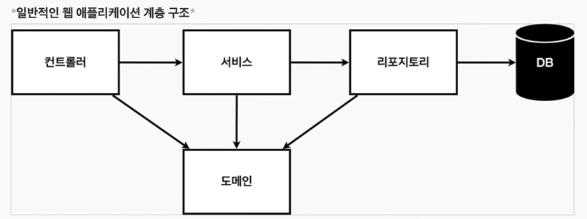

# 2021-08-03

# [Spring]

### 스프링 웹 개발 기초

1. 정적 컨텐츠
   - 그대로 보여준다. 프로그래밍을 할 수 없다.
   - controller가 없다.
   - resources에 html을 찾아 브라우저로 리턴해준다.
2. MVC, 템플릿 엔진
   - Model, View, Controller
   - 브라우저로 부터 url 요청이 오면, 작업후 view를 찾아 바꾼 후, return해준다
3. API
   - html 방식이 아니라 데이터를 내린다. 브라우저가 화면을 만든다.
   - @ResponseBody 가 꼭 필요하다. 응답 바디에 return 내용을 넣어주겠다.라는 의미
   - html이 아니라 그냥 그대로 return된다.
   - api방식으로 return 한다. = 객체로 만들어 반환한다. = json형식
   - getter, setter 방식 - private 변수를 get변수/set변수를 만든다는 것
   - HttpMessageConverter가 동작한다.(jsonconverter / stringconverter
   - 받는 형식 : xml, json 뭐로 받을 지 클라이언트가 http accept 헤더에 기입할 수 있다.


### 회원관리 예제 - 백엔드 개발



- 컨트롤러 : 웹 mvc의 컨트롤러 역할
- 서비스 : 핵심 비즈니스 로직 구현
- 리포지토리 : DB접근, 도메인 객체를 DB에 저장하고 관리
- 도메인 : 비즈니스 도메인 객체


1. 회원 도메인과 리포지토리 만들기

   - domain 패키지 내에 Member 클라스 만들기 - alt + insert를 통해 getter setter 자동 완성 활용

     ```java
     package skj.firstpjt.domain;
     
     public class Member {
     
         private Long id;
         private String name;
     
         public Long getId() {
             return id;
         }
     
         public void setId(Long id) {
             this.id = id;
         }
     
         public String getName() {
             return name;
         }
     
         public void setName(String name) {
             this.name = name;
         }
     }
     ```

   - Repository 패키지 내에 MemberRepository 인터페이스 와 MemoryMemberRepositry 클라스를 만든다. alt +enter로 implement method 해주기

     ```java
     package skj.firstpjt.repository;
     
     import skj.firstpjt.domain.Member;
     
     import java.util.List;
     import java.util.Optional;
     
     public interface MemberRepository {
         Member save(Member member);
         Optional<Member> findById(Long id);
         Optional<Member> findByName(String name);
         List<Member> findAll();
     }
     ```

     ```java
     package skj.firstpjt.repository;
     
     import skj.firstpjt.domain.Member;
     
     import java.util.*;
     
     public class MemoryMemberRepository implements MemberRepository {
     
         private static Map<Long, Member> store = new HashMap<>();
         private static long sequence = 0L;
     
         @Override
         public Member save(Member member) {
             member.setId(++sequence);
             store.put(member.getId(), member);
             return member;
         }
     
         @Override
         public Optional<Member> findById(Long id) {
             return Optional.ofNullable(store.get(id));
         }
     
         @Override
         public Optional<Member> findByName(String name) {
             return store.values().stream()
                     .filter(member -> member.getName().equals(name))
                     .findAny();
         }
     
         @Override
         public List<Member> findAll() {
             return new ArrayList<>(store.values());
         }
     }
     ```

     
