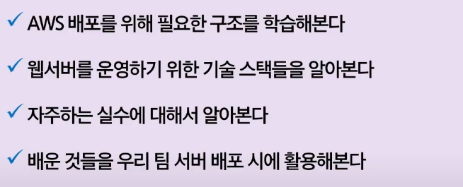

# 2021-08-11

# [AWS 배포]

브라우저 - NGINX ( F / B )

- NGINX : 정적인 파일을 서비스할 때 뒤어남 ( VS 톰캣 )

  80 or 443 번 포트로.. 약속!

  / : 프론트엔드로

  /api : 백엔드로

- docker : 빠르게 필요한 서버를 증설할 수 있다.

  vm 증설하는 방식은 부팅되는 1분에 서비스가 중지된다.

임의의 포트를 쓰면 안되는 이유

- 위치, 장소마다 포트를 막아뒀을 수 있다.

SSL(>TLS)

Cert Bot ( 비영리 프로젝트 )

- nginx, be 모두 설정이 필요하다.

사용자 계정 만들기 - ubuntu 계정이나 root 계정으로 하면 위험하다.
