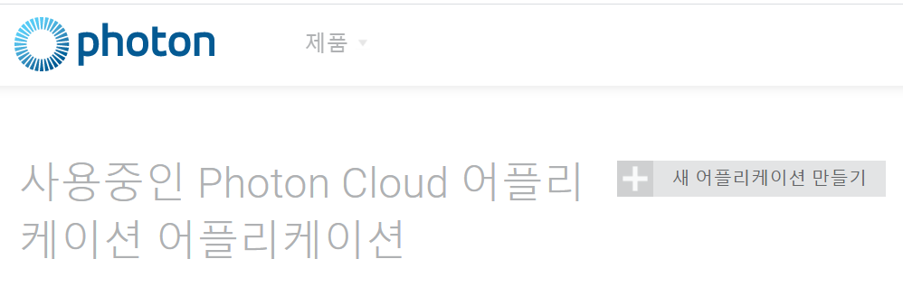
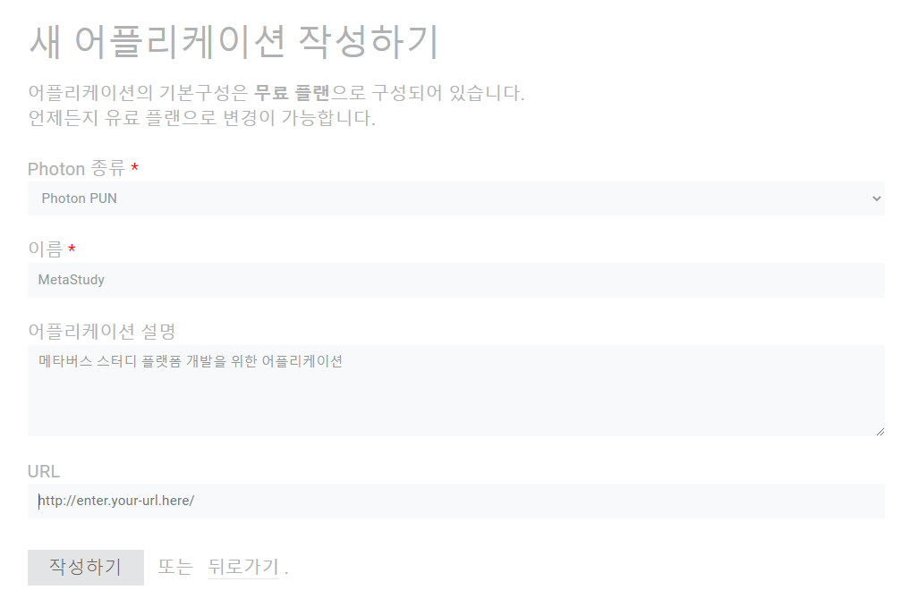
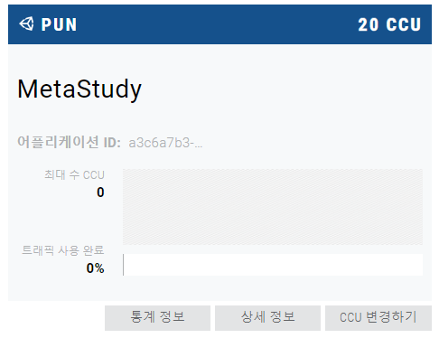
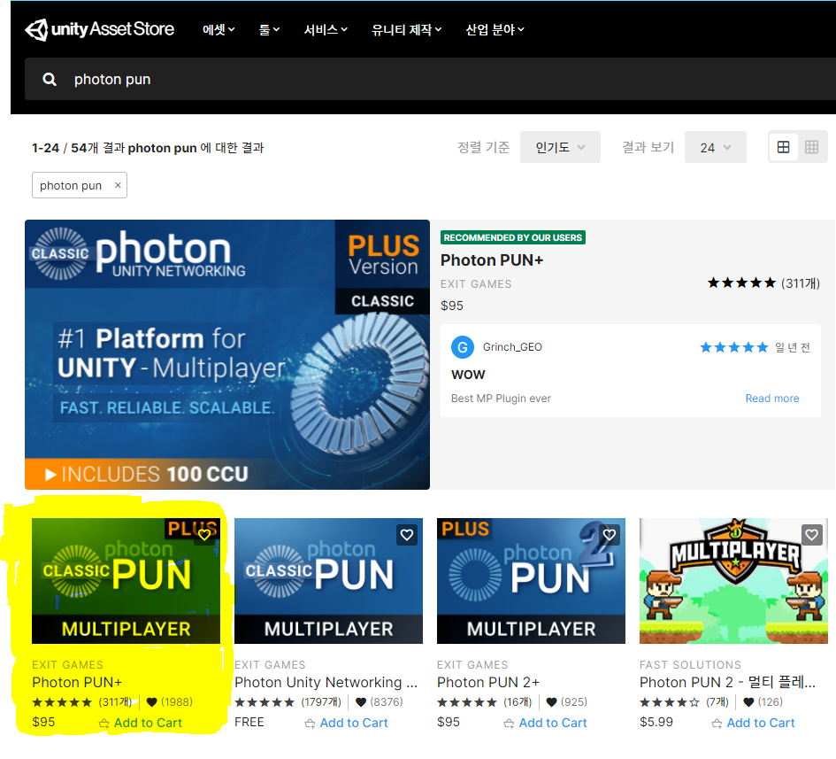
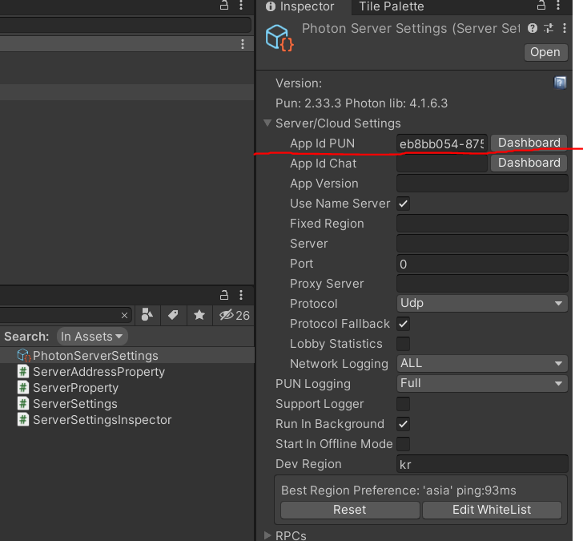

# 2021-08-19

# [공통 프로젝트 관련 포톤서버_유니티연동]

## 외부 서비스 정보 문서

### 포톤클라우드

> https://www.photonengine.com/ko-KR/

세계 No1의 독립 네트워킹 엔진, 멀티 플레이어 플랫폼입니다.

포톤 클라우드를 통해 게임 서버를 연결하여 멀티플레이와 커뮤니케이션이 가능하도록 해줍니다.

- Photon Cloud 생성 방법

  1. 회원가입

  2. 관리화면으로 이동

  3. 새어플리케이션 만들기 클릭

     

  4. 어플리케이션 생성 - URL은 비어두어도 됌

     

  5. 어플리케이션 생성 확인 - **어플리케이션 ID 기억해 둘것(저장!)**

     

### 유니티

> 게임 개발 엔진

- Photon cloud 연결 방법

  1. Unity 실행

  2. window - asset store 접속 - photon pun 검색 후 - asset import

     

  3. Photon server settings 내에 저장해둔 ID 입력

     

  4. Unity 개발시, photon cloud와 연동되어 개발 진행 가능!
