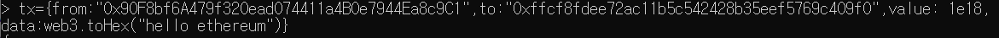
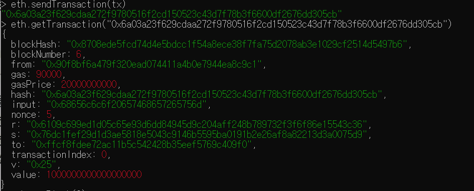
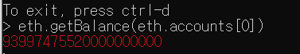

# 2021-08-23

# [블록체인 사전학습]

### 1. 블록체인 네트워크의 이해

- 이더리움 블록체인 네트워크의 분류
  - 프라이빗 네트워크 - 좁은 네트워크 상에서
  - 퍼블릭 네트워크 - 내가 아는 이더리움
    - 메인넷 - 거래소상 거래, 운영되는 실제
    - 테스트넷 - 경험용 4가지가 있다.
- 이더리움 네트워크 개념도
  - 여러개의 노드로 구성되어 있고 각 노드들은 데이터가 동기화? 되어 있다.
  - 노드는 여러개의 블록으로 구성되어 있고 클라이언트(geth)로 접속


#### 환경설정

- chocolatey install

  - choco install git -y
  - choco install golang -y
  - chogo install mingw -y
  - geth 설치 : 폴더 만든 후, git clone https://github.com/ethereum/go-ethereum --branch v1.9.24 폴더 위치
  - 컴파일 진행 - go get -u -v golang.org/x/net/context
  - 설치 - go install -v ./cmd/...

- node.js 설치 - powershell - choco install nodejs-lts

- ganache-cli 설치 - cmd - npm install -g ganache-cli

  - 직접 이더리움에 접속하는게 아닌, 가나슈가 이더리움 역할로써 로컬에서 개발할 수 있도록

- Metamash 설치 : 지갑프로그램 설치

  - https://metamask.io/
  - 크롬확장프로그램으로 설치
  - 이더리움 계정 생성
    - 비대칭키 암호화 알고리즘 : 개인키 공개키로 나뉘고 개인키로 암호화, 공개키로 복호화하여 두 해시값이 같으면 내가한 서명이다.

- 가나슈 구동

  - 로컬 테스트넷 구동 : ganache-cli -d -m -p7545 -a 5
    - 포트지정, 생성계정수

- geth 명령어로 가나슈 테스트넷에 접속 : geth attach http://localhost:7545

  ```cmd
  > net.listening
  true
  > net-peerCount
  ReferenceError: peerCount is not defined
          at <eval>:1:5(1)
  
  > net.peerCount
  0
  > eth.accounts
  ["0x90f8bf6a479f320ead074411a4b0e7944ea8c9c1", "0xffcf8fdee72ac11b5c542428b35eef5769c409f0", "0x22d491bde2303f2f43325b2108d26f1eaba1e32b", "0xe11ba2b4d45eaed5996cd0823791e0c93114882d", "0xd03ea8624c8c5987235048901fb614fdca89b117"]
  > web3.fromWei(eth.getBalance(eth.accounts[0]))
  100
  ```

  

#### 과제

1. 내용을 넣어 보내자. "hello ethereum" 메세지를 넣어서 1이더 보내기





- 잔고 확인



2. 에세이 작성

   - 많은 사람들이 블록체인에 기록된 데이터를 신뢰할 수 있다고 말합니다. 그 근거는 무엇일까요?

     블록체인은 발생한 거래에 대한 **동일기록 을 다수의 데이터 저장소에 즉시 분산 저장**하는 기술 이다. 이 때 수학적 함수를 활용해 저장된 단위 데이터의 변경을 어렵게 함으로써 위변조의 위험에서 보호할 수 있는 구조를 제공한다. 이런 특징은 블록체인을 ‘신뢰’를 제공하는 시스템으로 정의하는 필요충 분조건이 된다. 

   - 블록체인이 산업계에 미치는 영향을 언급하고, 이를 기반으로 한 응용 사례를 제시하세요.

     블록체인은 이해관계자들이 거래의 발생 과 기록을 동시에 공유함으로써 지금까지 우리 사회 의 근간이 됐던 관리, 감독, 보증, 인증, 허가 등에 필수적이던 중간자, 또는 매개자들의 역할을 축소할 수 있는 구조를 제공한다.

     블록체인 특징들의 조합을 통해 유·무형 의 자산에 대해 원본을 증명하는 것이 용이해졌다. 지금까지 우리의 상식으로는 디지털 자산의 복사가 매우 쉬워 무엇이 원본인지 증명하는데 많은 노력과 시간을 필요로 했다. 블록체인 기술을 활용하면 다이아몬드, 디지털로 만들어진 종류의 자산, 음원, 그림, 저작권, 증명서가 원본임을 쉽게 증명할 수 있다. 이런 특징은 디지털 자산 유통에 큰 영향을 끼칠 것으 로 기대된다. 

     **사기 범죄 제거, 자산가치 보증, 문화 산업의 재구성**
