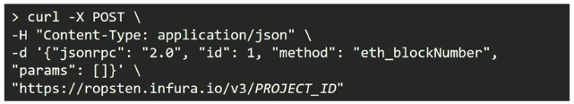

# 2021-08-24

# [블록체인 사전학습]

### 1. 퍼블릭 네트워크 활용 및 실습

방법3

1. 지갑을 통해 네트워크 활용하기
2. 노드 서비스로 네트워크 활용하기
3. 노드로 직접 참여하기

#### 1. 지갑을 통해 네트워크 활용하기 (메타마스크)

- 메타마스크에서 계정 가져오기를 통해 keystore안에 있는 private key를 등록하여 계정을 등록한다.
- 메타마스크에서 제공하는 노드를 통해 블록체인으로 연결되게 된다.

#### 2. 노드 서비스로 네트워크 활용하기

- infura.io  노드 서비스를 통해

  

#### 3. 노드로 직접 참여하기

- personal.unlockAccount(eth.accounts[0]) : private key에 접근하게 하겠다.
- tx 내에 gas, gasPrice, nonce 가 추가된다. 뭘까?

### 결국은 이더가 들어와야 진행할 수 있다...

