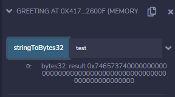
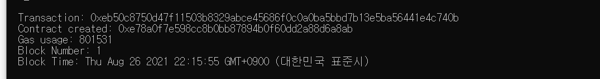

# 2021-08-26

# [블록체인]

## 스마트컨트랙트

- Nick Szabo에의해 정의
- 스마트하지 않은 단순 컴퓨터 프로그램. 법적 맥락 없음. 다소 잘못된 용어
- 불변의 컴퓨터 프로그램(by 마스터이더리움)
  - 불변(immutable) : 한번 배포시 변경 불가
  - 결정적 실행한 결과가 모두 같음
  - EVM 위에서 동작 (Ethereum virtual machine)
- 스마트컨트랙트 배포 과정
  - 스마트 컨트랙트 코드 작성 ( 솔리디티 ) > 컴파일 (ABI 생성 : )
  - 바이트 코드 > 트랜잭션 생성
  - 컨트랙트 배포 트랜잭션 > 트랜잭션 처리 (CA 생성 : 계정같은거 contract address : private key가 없다 <> EOA는 있다)
  - 블록에 담김 > 네트워크에 블록전파
  - 블록 동기화
- 스마트컨트랙트 호출 과정
  - 트랜잭션 생성 ( 사용자계정(EOA), CA, ABI, 함수의 주소, 매개변수)
  - 컨트랙트 호출/트랜잭션 생성 > 트랜잭션 처리
  - 블록에 담김 > 네트워크에 블록 전파, 트랜잭션 실행
  - 블록 동기화

### 과제

1. Remix IDE의 예제 코드인 3_Ballot.sol을 javascript VM 환경으로 배포해보고 호출해봅니다.

   - storage와 같은 방식으로 한다.

   - Deploy 과정 중에 에러가 발생한다. value 값이 배열로 들어가야한다고 한다. ["skj"] 로 집어 넣어봤다

     

   - 검색해보니 32bytes로 문자를 변환해야한다고 한다.

     아래와 같이 하나의 .sol을 만들고 배포 후, 'test'라는 문자를 넣어 32bytes를 얻는다.

     ###### 

     ###### 

   - ["0x7465737400000000000000000000000000000000000000000000000000000000"]
   - 0xA831F4e5dC3dbF0e9ABA20d34C3468679205B10A : contract 주소

2. Ganache cli 테스트넷에서 remix로 배포하기

   - ganache-cli -d -m -p7545 -a 5 명령어를 통해 가나슈 구동 및 계정 생성

   - remix - deploy에서 environment를 web3 provider로 변경

     ###### 

   - 

3.  geth console을 통한 배포하기

   - abi, bytecode를 넣어준다

   - ballContract = web3.eth.contract(abi) : contract을 만든다

   - tx={from:eth.accounts[0], data: bytecode, gas:3000000} : transaction을 만든다.

   - ballotContract.new(tx, function(e, contract) {console.log(e, contract.address)})

     

     

   - 호출
   - ballot = web3.eth.contract(abi).at("0xe78a0f7e598cc8b0bb87894b0f60dd2a88d6a8ab")

4. Metamask로 배포/호출하기

   web3.provider로 바꾸면 나의 계정으로 연결됌

   ###### 

   - 배포완료

   
