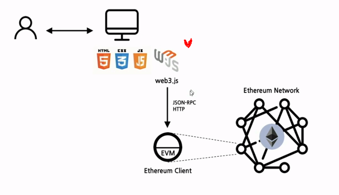

# 2021-08-26

# [블록체인]

## 스마트컨트랙트 / DApp

#### 솔리디티 컨트랙트 기본 구조

```
// SPDX-License-Identifier: GPL-3.0
pragma solidity >=0.7.0 <0.9.0;

contract Storage {

    uint256 number;

    function store(uint256 num) public {
        number = num;
    }

    function retrieve() public view returns (uint256){
        return number;
    }
}
```

- 모금 예제를 통한 구현

  ```
  // SPDX-License-Identifier: GPL-3.0
  pragma solidity >=0.7.0 <0.9.0;
  
  contract FundRaising {
      uint256 public constant MINIMUM_AMOUNT = 1e16;
      uint public fundRaisingCloses;
      address public beneficiary;
      
      constructor (uint _duration, address_beneficiary) {
      	fundRaisingCloses = block.timestamp + _duration;
      	beneficiary = _beneficiary;
      }
  
  	function fund() public {}
  	function currentCollection() public {}
  	function withdraw() public {}
  }
  ```

  

1. fund

   - if 는 require로 간단하게 나타낼 수 있다.

     require(msg.value >= MINIMUM_AMOUT, "MINIMUM AMOUT : 0.01 ether")

   - payable : 무조건 이 함수 실행을 위해 이더를 내야한다

   ```
   function fund() pulbic payable {
   	if(msg.value >= MINIMUM_AMOUNT)
   		if(block.timestamp < fundRaisingCloses) {}
   }
   ```

   - address funder = msg.sender; : 주소 저장
   - address[] funders;    -    funders.push(funder);

2. currentCollection

   ```
   function currentCollection() public returns(uint256) {
   	return address(this).balance; // 이 컨트랙트에 포함된 이더
   }
   ```

   - returns 앞에 view를 넣게 되면, 읽기만 하는 함수로 만든다

3. withdraw

   - 지정 수령자만 호출
   - 모금 종료후에만 호출

   ```
   modifier onlyBeneficiary() {
   	require(msg.sender == beneficiary);
   }
   
   function withdraw() public payable 
   onlyBeneficiary {
   	require(block.timestamp > fundRaisingCloses);
   	msg.sender.transfer(address(this).balance);
   }
   ```

   

### DApp

> Decentralized Application

탈중앙화된 P2P 네트워크 상에 백엔드 로직이 구동되는 응용프로그램

구성 : Frontend + Smart Contracts on Blockchain

구성요소

1. 스마트 컨트랙트

2. 사용자 인터페이스

3. **Web3 API for Javascript** : 이더리움 스마트 컨트랙트와 javascript 간의 상호작용 지원

   ###### 

#### Web3.js 실습

폴더를 만들고 npm i web3 를 통해 web3를 설치 완료

이후 js 파일로 코드를 작성

web3.eth - 형식으로 조회, 전송 등 가능

- 동기처리

  ```
  web3.eth.sendTransaction({
  	from: FROM_ADDRESS,
  	to: TO_ADDRESS,
  	value: VALUE_IN_WEI
  })
  .on('transactionsHash', hash => {})
  .on ~~
  ```

  

