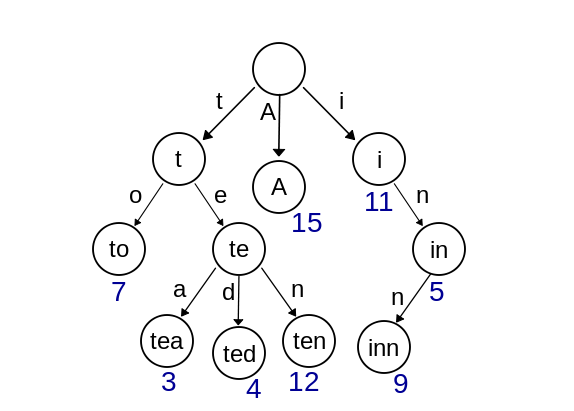
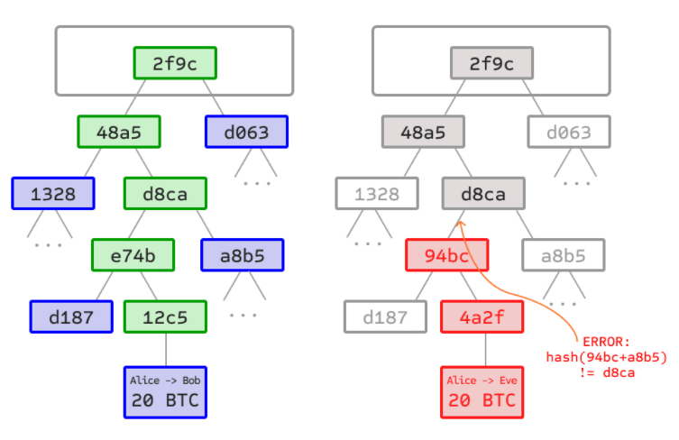

## Ethereum

비트코인과의 차이

- 복잡한 로직을 구현할 수 있다. 

- 스마트 컨트랙트를 내세운다

- SHA 계열의 비트코인 암호해시함수, ASIC 저항성 향상, 채굴의 중앙화를 해소하는 Ethash 해시함수 사용

- MPT : 트랜잭션 데이터의 위변조 감지 및 스마트 컨트랙트 관련 상태 정보를 저장하기 위한 기술

  1세대는 mekle tree를 이용해 위변조를 감지했다. 이더리움은 patricia trie와 접목한 MPT를 사용해 key-value 형식으로 저장 관리한다.

  - Patricia trie : path에 key를 집어 넣자. 공통의 prefix를 가지는 노드들은 같은 path를 가진다. 가면서 하나씩 채우는 형식. 

    

  - merkle tree : hash tree이다. hash함수 트리로 연결되어 있어. 일부 수정 사항은 부모 트리를 구현하는데 이상이 생기게 된다.

    

- 암호화폐관리 기술의 차이 - 비트코인 : UTXO(소비되지 않은 거래 출력), -이더리움 : 사용자 계정 중심


#### 노드

각 개인, 기업이 가지고 있는 서버, 이것들이 모여 네트워크를 이루게 된다.

풀노드 : 모든 기능을 다 가지고 있는 노드 ,최초 블록부터 현재까지 다

라이트노드 : 원본이 아닌 헤더만 가지고 있는 노드, SPV : 풀노드에 검증을 요청하는 방법


### 이더리움이나 하이퍼 패브릭

흔하디 흔한 주제들이네. 

거래는 이더리움

추적은 패브릭

NFT : 예술품 가치


## 실습 과제 (로컬 네트워크 구현)

1. 가상머신 구성
   - Virtual Box 설치
   
   - Vagrant 설치
   
   - 호스트와 가상 머신 간 파일 전송 플러그인 설치
   
     vagrant plugin install vagrant-scp
   
   - vagrantfile 수정
   
     ```
     # -*- mode: ruby -*-
     # vi: set ft=ruby :
     
     # All Vagrant configuration is done below. The "2" in Vagrant.configure
     # configures the configuration version (we support older styles for
     # backwards compatibility). Please don't change it unless you know what
     # you're doing.
     
     VAGRANT_API_VERSION="2"
     
     vms = {
       'eth0' => '10',
       'eth1' => '11'
     }
     
     Vagrant.configure(VAGRANT_API_VERSION) do |config|
       config.vm.box = "ubuntu/bionic64"
       vms.each do |key, value|
         config.vm.define "#{key}" do |node|
           node.vm.network "private_network", ip: "192.168.50.#{value}"
           if "#{key}" == "eth0"
             node.vm.network "forwarded_port", guest: 8545, host: 8545
           end
           node.vm.hostname = "#{key}"
           node.vm.provider "virtualbox" do |nodev|
             nodev.memory = 2048
           end
         end
       end
     end
     
     ```
   
   - 가상 머신 구동 명령어 : vagrant up
   
   - vagrant status
   
   - vagrant ssh eth0 : 해당 머신에 접속한다.
   
2. 가상 머신 하나에 접속 후, 환경 설정 eth0

   - Ubuntu version 확인 : cat /etc/issue    or   lsb_release -a

   - geth 설치하기

     ```
     sudo apt-get update
     sudo apt-get install software-properties-common
     sudo add-apt-repository -y ppa:ethereum/ethereum
     sudo apt-get install ethereum
     geth version
     ```

   - geth account new 를 통해 계정을 생성해준다. 기본적으로 경로가 keystore:///home/vagrant/.ethereum/keystore/UTC 에 위치한다. 위치를 지정해줄순 없을까?

   - coinbase 설정 기본적으로 첫번째꺼가 된다

     이더베이스(etherbase) 변경

     miner.setEtherbase(eth.accounts[999])

