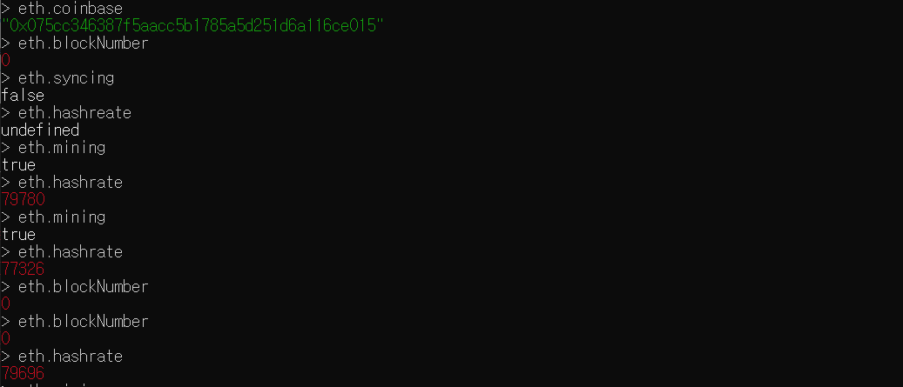

## 실습 과제 (로컬 네트워크 구현)

1. genesis.json을 활용하여 초기 블록을 만들었고  = 프라이빗 네트워크 구현

   ```
   {
       "config": {
           "chainId": 921,
           "homesteadBlock": 0,
           "eip155Block": 0,
           "eip158Block": 0
        },
        "nonce": "0xdeadbeefdeadbeef",
        "timestamp": "0x00",
        "parentHash": "0x0000000000000000000000000000000000000000000000000000000000000000",
        "extraData": "",
        "gasLimit": "9999999",
        "difficulty": "0x10",
        "mixhash": "0x0000000000000000000000000000000000000000000000000000000000000000",
        "coinbase": "0x3333333333333333333333333333333333333333",
        "alloc": {}
   }
   ```

   이런 식으로 구현해서 초기 블록을 만들어줬다

2. 각 노드의 geth 명령어는 조건에 맞춰 실행시켜줫다.

   geth --datadir ~/dev/eth_localdata --networkid 921 --http --http.addr 0.0.0.0 --http.port "8545" --http.corsdomain "*"  --port "30303" --maxpeers 2 --mine console

   다양한 옵션들이 있다.

   1. 순서대로

      chaindata 위치 설정, networkid 설정, rpc설정, rpc_address 설정, rpc_port 설정, rpc_corsdomain 설정, port 설정, 최대 인원 설정, mining 여부를 모두 맞춰서 실행해 줬다.

   2. 하지만 결과가 이상하다

      

miner.start()를 해주고 mining 상태도 true 이지만 채굴이 되지 않는다. 무슨 설정이 문제인지 확인한 뒤, 다시 commit 하도록 하자


### 해결

처음부터 다시했다.

먼저 계정을 만드는 것이 아니라

localdata 내에 계정을 만들었다. 즉, 계정을 만들고 실행시킨 것이 아니라 geth 서버 내에서 계정을 만들었다.

1. genesis.json 가 초기에 생성되지 않아, 확인결과

   ```
   {
       "config": {
           "chainId": 921,
           "homesteadBlock": 0,
           // 이 아래 두부분이 문제라는 이야기가 있었다. 지웠다.
           "eip155Block": 0, //제거
           "eip158Block": 0  //제거
        },
        "nonce": "0xdeadbeefdeadbeef",
        "timestamp": "0x00",
        "parentHash": "0x0000000000000000000000000000000000000000000000000000000000000000",
        "extraData": "",
        "gasLimit": "9999999",
        "difficulty": "0x10",
        "mixhash": "0x0000000000000000000000000000000000000000000000000000000000000000",
        "coinbase": "0x3333333333333333333333333333333333333333",
        "alloc": {}
   }
   ```

   이후 초기 block이 만들어졌고

2. geth --datadir ~/dev/eth_localdata --networkid 921 --http --http.addr 0.0.0.0 --http.port "8545" --http.corsdomain "*"  --port "30303" --maxpeers 2 --mine console

   mine 명령어는 계정이 있을 때 가능하므로 계정 생성 전에는 mine을 지운 후, 실행시킨다.

   personal.newAccount("비밀번호") 로 계정을 생성한 뒤 서버를 종료하고 다시 mine을 붙여 실행 시키면 해당 계정이 coinbase 상태이다

   miner.start() 시 채굴이 잘된다

   
