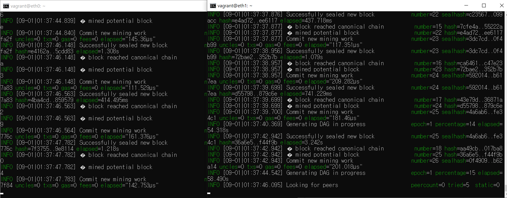
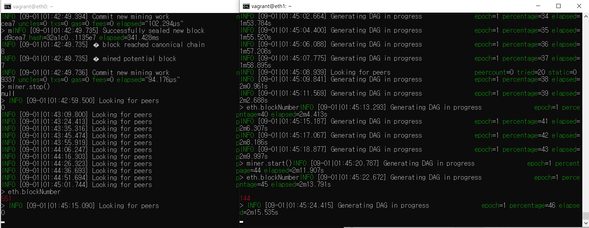
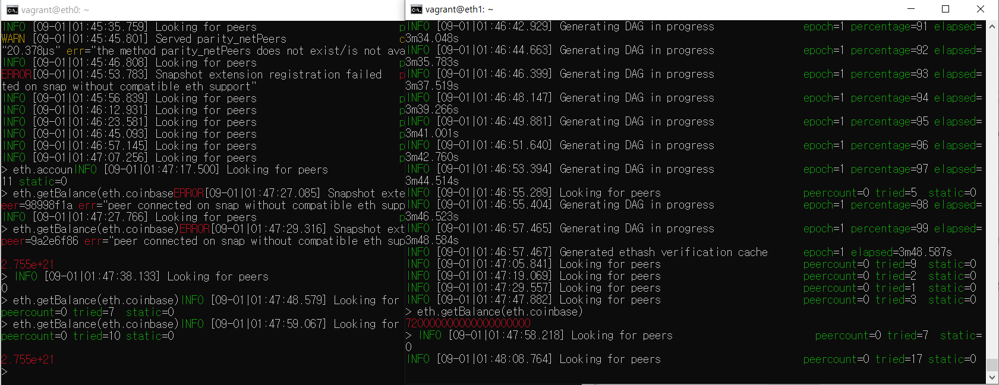
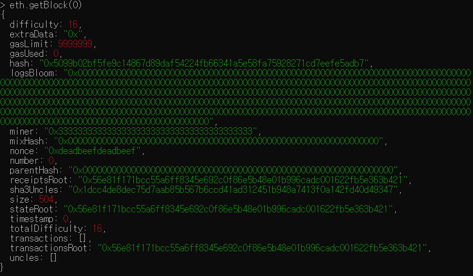
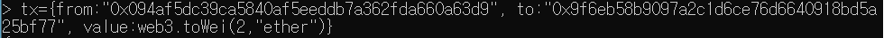
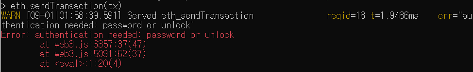
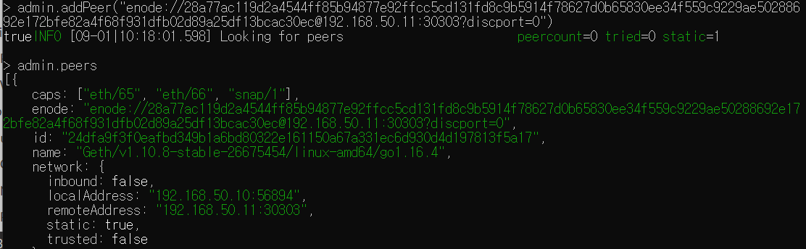
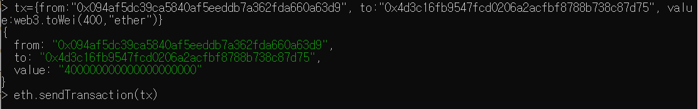

## 실습 과제 (로컬 네트워크 구현)

1. eht0, eth1에서 각각 채굴하기 **성공!**

   

   geth 실행 명령어가 중요하다. 명세서 조건에 따른 명령어는 아래와 같다

   eth0

   : geth --datadir ~/dev/eth_localdata --networkid 921 --http --http.addr "0.0.0.0" --http.port "8545" --http.api "admin,eth,debug,miner,net,txpool,personal,web3"  --port "30303" --maxpeers 2 --mine console

   eth1

   : geth --datadir ~/dev/eth_localdata --networkid 921 --http --http.port "8545" --port "30303" --maxpeers 2 --mine  console

   이후 각각 miner.start() 시 채굴이 시작된다.

2. 각각의 채굴된 block 수 조회

   eth.blockNumber

   

3. 계정 잔액 조회

   eth.getBalance(eth.coinbase)

   

4. 블록 상세 정보 조회

   eth.getBlock(숫자)

   

### 트랜잭션

1. eth0 계정 : 0x094af5dc39ca5840af5eeddb7a362fda660a63d9

   eth1 계정 : 0x9f6eb58b9097a2c1d6ce76d6640918bd5a25bf77

   트랜잭션 생성

   

   왜 에러가 뜨는가....

   

   권한을 해제 하라는 말 같다

   eth1의 권한을 unlock해보자

   personal.unlockAccounts(eth.accounts[0], 비번)

   그래도 invalid sender라는 메세지가 뜬다... 어찌해야하는가...
   
   admin.addPeer를 위해 주소를 바꿔주어야 한다고 한다.
   
   eth1의 enode 주소인 
   
   "enode://28a77ac119d2a4544ff85b94877e92ffcc5cd131fd8c9b5914f78627d0b65830ee34f559c9229ae50288692e172bfe82a4f68f931dfb02d89a25df13bcac30ec@127.0.0.1:30303?discport=0"
   
   에서 127.0.0.1 가 아니라 eth1 설정시 해준 주소인 192.168.50.11 주소로 바꾸어서 eth0에 addPeer해준다
   
   
   
   추가와 함께, peers가 추가된 것을 확인할 수 있다.
   
   eth1의 경우에도 commend 창에 추가됬다는 메세지가 올라온다.
   
   이후 sendTransaction을 해주면, 거래가 성공적으로 이루어 진다
   
   
   
   그런데.. 끄고 다시 거래를 하면 되지 않는다... 왜일까..??
