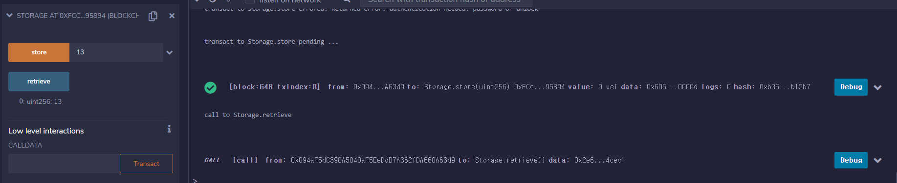

## 실습 과제 (로컬 네트워크 구현)

어제까지의 의문점

서로간 거래 트랜잭션은 생성되었는데, 왜 안보내지고, 보유량도 안바뀔까?

### 해결

- 송금을 한 후, 무조건 miner.start()를 해줘야한다. 그래야 정상적으로 갱신된다. 왜그런진..... 잘....;

  

  0번에서 1번으로 누적된 tx가 다 넘어갓다.. 2000이 넘어갓네;;


### 이후 과제 진행

- 포트포워딩 확인!

  


- 메타마스크와 연동하기

  localhost:8545에 chainId를 바꾸어 등록했다

  


- 스마트 컨트랙트 배포

  Remix 내에서 Deploy & Transaction으로 간다

  Web3 Provider를 선택하면 안에서 무슨 명령어를 쳐야 연결할 수 있다고 뜬다

  geth 서버 실행시 

  geth --datadir ~/dev/eth_localdata --networkid 921 --http --http.addr "0.0.0.0" --http.port 8545 --http.api admin,eth,debug,miner,net,txpool,personal,web3 --http.corsdomain="https://remix.ethereum.org"  --port 30303 --maxpee
  rs 2 --mine --allow-insecure-unlock --nodiscover console

  --http.corsdomain="https://remix.ethereum.org" 를 추가해주자

  

  정상 연결 된다

  이후 storage.sol로 예제를 진행한 결과

  전과 같이 miner.start() 까지 해주면 배포가 완료된다

  

  이후, 숫자도 저장하고 호출하면, 이상한 에러가 또 뜬다~

  ```
  call to Storage.retrieve errored: Returned error: invalid opcode: SHR
  ```

  계속 뜬다.. 강제로 해도 뜬다

  구글 검색 결과, 

  ```
  "byzantiumBlock": 0,
  "constantinopleBlock": 0
  ```

  를 genesis.json의 config에 추가해 주면 된다고 한다. 이유는 또 모르겠다;;

  추가하고 block 재 생성하고 store, retrieve를 하면  

  

  아주 잘 된다~

- 마지막 스켈레톤 프로젝트에서 작동시켜보기

  스켈레톤 프로젝트를 실행한다. 거의 다 만들어져 있다. 나는 네트워크를 이것에 연결하기만 하면 된다

  위 remix를 연결했듯이 geth 명령어에 corsdomain을 localhost:8081 과 같은 vue 서버 에 연결만 해주면 된다. 나는 localhost:8081이 vue 서버였기에

  $ geth --datadir ~/dev/eth_localdata --networkid 921 --http --http.addr "0.0.0.0" --http.port 8545 --http.api admin,eth,debug,miner,net,txpool,personal,web3 --http.corsdomain="http://localhost:8081"  --port 30303 --maxpeers 2
  --mine --allow-insecure-unlock --nodiscover console

  로 geth를 켜주면

  Explorer 에 block 정보, tx 정보들이 보여진다

  

