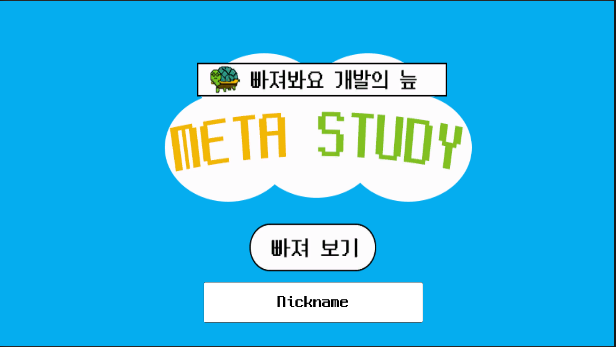
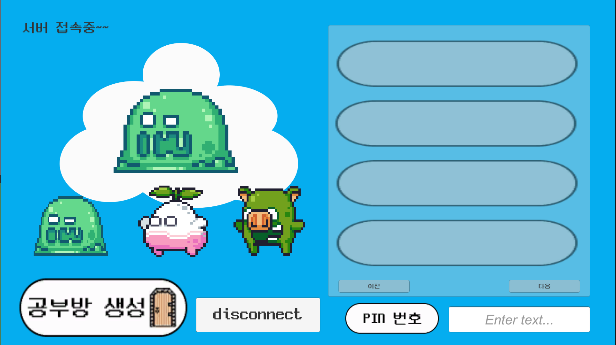
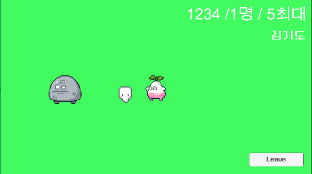

# 7/26~30

# 유니티 구현

1. 닉네임 입력 후, Photon 서버 접속 구현
   - Photon 패키지, 라이브러리, 서버를 이용하여 서버 연동 및 접속 가능
   
     
   
   
   
2. 방 생성/참가 및 로비 내에서 방 리스트 구현

   - Photon 내 메서드를 이용하여 방 구현 및 참가 구현 (서버 접속 후 생성 및 참여 가능)

3. 캐릭터 선택 구현
   - 캐릭터 오브젝트 별 프리팹을 활용

   - Data를 저장해 두는 object를 생성 후, 데이터(어떤 캐릭터를 선택했는지)를 저장해 둘 수 있도록 한다.

     

4. 멀티플레이어 방 접속 및 플레이어 이동 구현

   - Photonview 및 Photonview.RPC를 이용한 네트워크 동기화

5. 플레이어 - 오브젝트 간 상호작용 구현
   - Debugdraw - Raycast를 활용하여 오브젝트와의 접촉을 인식한다.

   - 오브젝트마다 scripts 내에 자신의 정보를 저장하여 접근하여 서로간의 정보를 확인한다.

     
